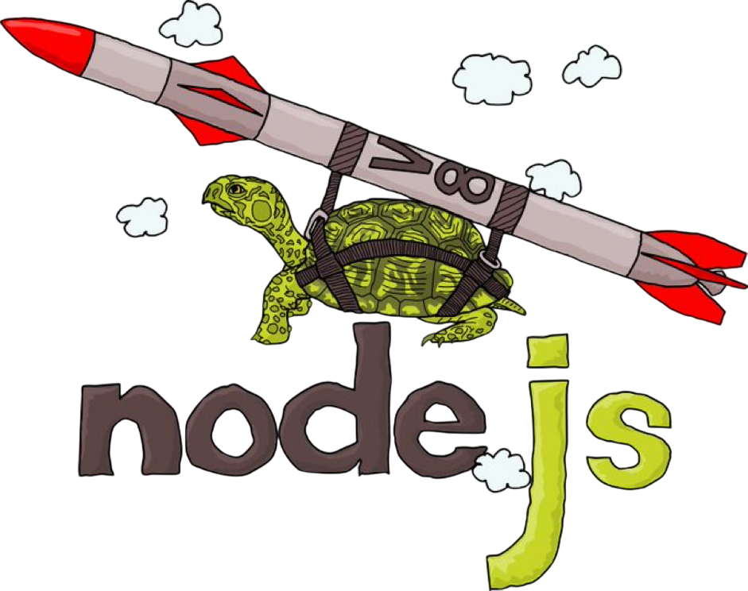

<!-- markdownlint-disable MD033 MD041 -->
<p></p>
<!-- markdownlint-enable MD033 MD041 -->

# NodeJS build utils

<!-- markdownlint-disable MD033 MD041 MD051 -->
<div>
  <h4 align="center">
    
    
    
    
  </h4>
</div>

<div align="center">


</div>

<div align="center"> <sub> Rocket turtle под авторством <a href="https://GitHub.com/nodejs/admin/issues/828">mcollina</a>. </sub> </div>
<!-- markdownlint-enable MD033 MD041 MD051 -->

## Description

Среда для сборки контейнера с зависимостями для NodeJS. Основан на [сборочных компонентах NodeJS](https://github.com/nodejs/node/blob/main/BUILDING.md) и таблице соотношения [Debian-Astra](https://wiki.astralinux.ru/pages/viewpage.action?pageId=53646577)

Присоединяйтесь к нашим социальным сетям:

<!-- markdownlint-disable MD033 -->

<div class="badges-row-public">
  <h4 align="center">
    <a href="https://t.me/NGR_Softlab">
      
    </a>
    &emsp; &emsp; &emsp;
    <a href="https://www.ngrsoftlab.ru/?utm_source=tg&utm_medium=start" >
      
    </a>
  </h4>
</div>

<!-- markdownlint-enable MD033 -->

## Contents

- [NodeJS build utils](#nodejs-build-utils)
  - [Description](#description)
  - [Contents](#contents)
  - [What it is](#what-it-is)
  - [How to work with](#how-to-work-with)
    - [Build variables](#build-variables)
  - [Assembly concept](#assembly-concept)
    - [Assembly requirements](#assembly-requirements)
    - [Assembly variables](#assembly-variables)
    - [Assembly support](#assembly-support)
    - [How test local](#how-test-local)
  - [Issues and solutions](#issues-and-solutions)
  - [How to install it](#how-to-install-it)
    - [Cya!](#cya)

## [What it is](#contents)

Dockerfile для сборки NodeJS, на основе отечественной ОС AstraLinux

## [How to work with](#contents)

Для начала работы необходимо установить [pre-commit](https://pre-commit.com/) и хуки

```console
$ pip install pre-commit
$ pre-commit --version

pre-commit 4.2.0

$ pre-commit install

pre-commit installed at .git/hooks/pre-commit
pre-commit installed at .git/hooks/commit-msg
pre-commit installed at .git/hooks/pre-push
```

> [!warning]
> Чтобы проверить свои изменения, воспользуйтесь командой `pre-commit run --all-files`.
> Чтобы проверить конкретную задачу, воспользуетесь командой `pre-commit run <target> --all-files`.
> Если Вы понимаете что творите и хотите пропустить проверку `pre-commit`-ом воспользуйтесь `--no-verify`, пример `git commit -m "Добавил изменения и не хочу проверки" --no-verify`

Собрать образ `Astra Linux based`

```shell
## Export NodeJS build utils version for 1.7.5
export ASTRA_VERSION='1.7.5-slim'
export NODEJS_BUILD_UTILS_VERSION="1.0.0-astra${ASTRA_VERSION}"

## NodeJS build utils image: 601MB
docker build \
    --progress=plain \
    --no-cache \
    -t nodejs-build-utils:"${NODEJS_BUILD_UTILS_VERSION}" \
    .

## Export NodeJS build utils version for 1.8.2
export ASTRA_VERSION='1.8.2-slim'
export NODEJS_BUILD_UTILS_VERSION="1.0.0-astra${ASTRA_VERSION}"

## NodeJS build utils image: 799MB
docker build \
    --progress=plain \
    --no-cache \
    --build-arg image_version="${ASTRA_VERSION}" \
    -t nodejs-build-utils:"${NODEJS_BUILD_UTILS_VERSION}" \
    .
```

### [Build variables](#contents)

| Имя              | Значение по умолчанию |  Тип   |                                                                                     Описание |
| :--------------- | :-------------------: | :----: | -------------------------------------------------------------------------------------------: |
| `image_name`     |         astra         | string |                                                                                  Имя образа. |
| `image_registry` |          ''           | string | Адрес до реестра образа. Например: `--build-arg image_registry=my-container-registry:1111/`. |
| `image_version`  |      1.7.5-slim       | string |                                                                               Версия образа. |

<!-- markdownlint-disable MD033 -->
<div align="center"> <sub> Таблица 1. Переопределяемые аргументы для Dockerfile. </sub> </div>
<!-- markdownlint-enable MD033 -->

## [Assembly concept](#contents)

- Представление [Makefile-а](init/Makefile.default.mk), который используется в CI-е
- Представление [Makefile-а](init/Makefile.svace.mk), который используется в анализатором Svace
- Представление [Makefile-а](init/Makefile.ninja.mk) на основе [ninja-build](https://ninja-build.org/), но в CI-е падает с ошибкой сборки:

```text
FAILED: obj/deps/v8/src/compiler/v8_compiler.pipeline.o
c++ -MMD -MF obj/deps/v8/src/compiler/v8_compiler.pipeline.o.d -D_GLIBCXX_USE_CXX11_ABI=1 -DNODE_OPENSSL_CONF_NAME=nodejs_conf -DNODE_OPENSSL_HAS_QUIC -DICU_NO_USER_DATA_OVERRIDE -DV8_GYP_BUILD -DV8_TYPED_ARRAY_MAX_SIZE_IN_HEAP=64 -D__STDC_FORMAT_MACROS -DOPENSSL_NO_PINSHARED -DOPENSSL_THREADS -DV8_TARGET_ARCH_X64 -DV8_HAVE_TARGET_OS -DV8_TARGET_OS_LINUX '-DV8_EMBEDDER_STRING="-node.20"' -DENABLE_DISASSEMBLER -DV8_PROMISE_INTERNAL_FIELD_COUNT=1 -DV8_ENABLE_PRIVATE_MAPPING_FORK_OPTIMIZATION -DV8_SHORT_BUILTIN_CALLS -DOBJECT_PRINT -DV8_INTL_SUPPORT -DV8_ATOMIC_OBJECT_FIELD_WRITES -DV8_ENABLE_LAZY_SOURCE_POSITIONS -DV8_USE_SIPHASH -DV8_SHARED_RO_HEAP -DV8_WIN64_UNWINDING_INFO -DV8_ENABLE_REGEXP_INTERPRETER_THREADED_DISPATCH -DV8_USE_ZLIB -DV8_ENABLE_TURBOFAN -DV8_ENABLE_WEBASSEMBLY -DV8_ENABLE_JAVASCRIPT_PROMISE_HOOKS -DV8_ALLOCATION_FOLDING -DV8_ALLOCATION_SITE_TRACKING -DV8_ADVANCED_BIGINT_ALGORITHMS -DUCONFIG_NO_SERVICE=1 -DU_ENABLE_DYLOAD=0 -DU_STATIC_IMPLEMENTATION=1 -DU_HAVE_STD_STRING=1 -DUCONFIG_NO_BREAK_ITERATION=0 -I../../deps/v8 -I../../deps/v8/include -Igen/generate-bytecode-output-root -Igen -I../../deps/icu-small/source/i18n -I../../deps/icu-small/source/common -pthread -Wno-unused-parameter -Wno-return-type -flax-vector-conversions -Wno-invalid-offsetof -fno-strict-aliasing -m64 -m64 -O3 -fno-omit-frame-pointer -fdata-sections -ffunction-sections -O3 -fno-rtti -fno-exceptions -std=gnu++17  -c ../../deps/v8/src/compiler/pipeline.cc -o obj/deps/v8/src/compiler/v8_compiler.pipeline.o
c++: fatal error: Killed signal terminated program cc1plus
compilation terminated.
[3250/4019] CXX obj/deps/v8/src/wasm/v8_base_without_compiler.wasm-result.o
[3251/4019] CXX obj/deps/v8/src/compiler/turboshaft/v8_turboshaft.store-store-elimination-phase.o
FAILED: obj/deps/v8/src/compiler/turboshaft/v8_turboshaft.store-store-elimination-phase.o
c++ -MMD -MF obj/deps/v8/src/compiler/turboshaft/v8_turboshaft.store-store-elimination-phase.o.d -D_GLIBCXX_USE_CXX11_ABI=1 -DNODE_OPENSSL_CONF_NAME=nodejs_conf -DNODE_OPENSSL_HAS_QUIC -DICU_NO_USER_DATA_OVERRIDE -DV8_GYP_BUILD -DV8_TYPED_ARRAY_MAX_SIZE_IN_HEAP=64 -D__STDC_FORMAT_MACROS -DOPENSSL_NO_PINSHARED -DOPENSSL_THREADS -DV8_TARGET_ARCH_X64 -DV8_HAVE_TARGET_OS -DV8_TARGET_OS_LINUX '-DV8_EMBEDDER_STRING="-node.20"' -DENABLE_DISASSEMBLER -DV8_PROMISE_INTERNAL_FIELD_COUNT=1 -DV8_ENABLE_PRIVATE_MAPPING_FORK_OPTIMIZATION -DV8_SHORT_BUILTIN_CALLS -DOBJECT_PRINT -DV8_INTL_SUPPORT -DV8_ATOMIC_OBJECT_FIELD_WRITES -DV8_ENABLE_LAZY_SOURCE_POSITIONS -DV8_USE_SIPHASH -DV8_SHARED_RO_HEAP -DV8_WIN64_UNWINDING_INFO -DV8_ENABLE_REGEXP_INTERPRETER_THREADED_DISPATCH -DV8_USE_ZLIB -DV8_ENABLE_TURBOFAN -DV8_ENABLE_WEBASSEMBLY -DV8_ENABLE_JAVASCRIPT_PROMISE_HOOKS -DV8_ALLOCATION_FOLDING -DV8_ALLOCATION_SITE_TRACKING -DV8_ADVANCED_BIGINT_ALGORITHMS -DUCONFIG_NO_SERVICE=1 -DU_ENABLE_DYLOAD=0 -DU_STATIC_IMPLEMENTATION=1 -DU_HAVE_STD_STRING=1 -DUCONFIG_NO_BREAK_ITERATION=0 -I../../deps/v8 -I../../deps/v8/include -Igen/generate-bytecode-output-root -Igen -I../../deps/icu-small/source/i18n -I../../deps/icu-small/source/common -pthread -Wno-unused-parameter -Wno-return-type -flax-vector-conversions -Wno-invalid-offsetof -fno-strict-aliasing -m64 -m64 -O3 -fno-omit-frame-pointer -fdata-sections -ffunction-sections -O3 -fno-rtti -fno-exceptions -std=gnu++17  -c ../../deps/v8/src/compiler/turboshaft/store-store-elimination-phase.cc -o obj/deps/v8/src/compiler/turboshaft/v8_turboshaft.store-store-elimination-phase.o
c++: fatal error: Killed signal terminated program cc1plus
compilation terminated.
ninja: build stopped: subcommand failed.
make[1]: *** [Makefile:149: node] Error 1
```

### [Assembly requirements](#contents)

**Особенности сборки**:
Существует 2 образа под сборку NodeJS из исходного кода:

- nodejs-build-utils:1.0.0-astra1.7.5
- nodejs-build-utils:1.0.0-astra1.8.1

Каждая из них имеет смысл, т.к. собирают NodeJS определенной версии. Сборка до `21.7.3` ([LTS](https://nodejs.org/en/about/previous-releases#looking-for-the-latest-release-of-a-version-branch) 20.18.1 Iron) производиться тегом `1.0.0-astra1.7.5`. Остальные версии, что выше, тегом `1.0.0-astra1.8.1`
Причина этой сборки - версии `python3` и `gcc` компиляторов, что участвует в сборке. Соответственно, при установке в ОС-ы необходимо учитывать данные ограничения

### [Assembly variables](#contents)

Данные переменные могут использоваться как для локальной сборки, так и для сборки через CI. Данные переменные применимы и оказывают эффект на [скрипт](init/Makefile.default.mk). Данный скрипт работает в следующих режимах:

- Сборка `node` с прохождением всех тестов сборки
- Сборка `node` без прохождения тестов

| Имя                        |        Значение по умолчанию        |    Тип     |                                                                                                                                                                                                                                                                    Описание |
| :------------------------- | :---------------------------------: | :--------: | --------------------------------------------------------------------------------------------------------------------------------------------------------------------------------------------------------------------------------------------------------------------------: |
| `MAKEFILE_INSTALL_DIR`     |             /usr/local              |   string   |                                                                                                                                                                                               Значение пути, куда будет установлен конечная версия артефакта, после сборки. |
| `MAKEFILE_NODE_DEPLOY_DIR` | [тут](init/Makefile.default.mk#L76) | stringspec |                                                                                                                                                                 Название директории, куда будет экспортирован артефакт для последующего развертывания в реестре артефактов. |
| `MAKEFILE_NUMBER_OF_CPUS`  |                 20                  |  integer   |                                                                                              Количество ядер `CPU`, которое будет использовано по умолчанию. Если значение велико для конкретной сборки, то можно проверить максимум посредством команды `nproc --ignore 1` |
| `MAKEFILE_SKIP_TEST`       |                FALSE                |   string   |                                                   Включить/Отключить пропуск тестов. Может быть актуален для версий, младше `20.18.1`. По умолчанию тесты включены. Чтобы отключить необходимо экспортировать переменную в режиме `TRUE`: `export MAKEFILE_SKIP_TEST=TRUE`. |
| `NODE_VERSION`             |       `${CI_COMMIT_REF_NAME}`       | stringspec | Ветка/тег собираемого интерпретатора. Если не указно, то использует [предопределенные переменные GitLab-a](https://docs.gitlab.com/ci/variables/predefined_variables). Если предопределенная переменная отсутствует, то используется значение по умолчанию: `test-version`. |

<!-- markdownlint-disable MD033 -->
<div align="center"> <sub> Таблица 2. Трактовка переменных для взаимодействия с Makefile. </sub> </div>
<!-- markdownlint-enable MD033 -->

### [Assembly support](#contents)

Легенда:

- ✅ — все тесты проходят
- ⚠️ — возможны проблемы (нужны патчи)
- ❌ — не поддерживается

| Версия Node.js |   Астра 1.7.x (Debian 10)     | Астра 1.8.x (Debian 12)  |
| :------------: | :---------------------------: | :----------------------: |
|  Node.js 12.x  | ⚠️ (есть проблемы с тестами)  |   ❌ (нужен Python2.7)   |
|  Node.js 14.x  |              ✅               |            ✅            |
|  Node.js 16.x  |           ✅ (LTS)            |            ✅            |
|  Node.js 18.x  | ⚠️ (требует --openssl-no-asm) |            ✅            |
|  Node.js 20.x  | ⚠️ (есть проблемы с тестами)  |         ✅ (LTS)         |
|  Node.js 21.x  |        ✅ (до 21.7.3)         |            ✅            |
|  Node.js 22.x  |    ❌ (нужен OpenSSL 3.0+)    | ⚠️ (тесты могут падать)  |

<!-- markdownlint-disable MD033 -->
<div align="center"> <sub> Таблица 3. Поддерживаемые версии Node.js (с прохождением тестов). </sub> </div>
<!-- markdownlint-enable MD033 -->

### [How test local](#contents)

1. Склонировать репозиторий с компилятором
2. Войти в интерактивную среду данного образа: `docker run -it --rm -v "$(pwd):/build" -w /build nodejs-build-utils:1.0.0-astra1.7.5 bash`
3. Объявить [необходимые](#assembly-variables) переменные, чтобы сформировать окружение для работы скрипта
4. Перенести `Makefile` в директорию с компилятором: `cp ./init/Makefile /path/to/nodejs/repo/Makefile-build`
5. Запустить сборщик: `make -f Makefile-build all`

Пример запуска сборщика

```shell
## Если необходимо пропустить тесты
export MAKEFILE_SKIP_TEST=TRUE
make -f Makefile-build all
```

## [Issues and solutions](#contents)

- Ошибка `Error: getaddrinfo ENOTFOUND localhost` связана с невозможность обращения к LO ввиду проблем с `/etc/hosts` файлом. Решение состоит в том, чтобы использовать тег сборки `docker-without-host-mapping`, который предотвращает общий маппинг хостового файла в сборки типа `dind`

```plaintext
Path: parallel/test-net-socket-connect-without-cb
node:events:497
      throw er; // Unhandled 'error' event
      ^
Error: getaddrinfo ENOTFOUND localhost
    at GetAddrInfoReqWrap.onlookup [as oncomplete] (node:dns:107:26)
Emitted 'error' event on Socket instance at:
    at emitErrorNT (node:internal/streams/destroy:169:8)
    at emitErrorCloseNT (node:internal/streams/destroy:128:3)
    at process.processTicksAndRejections (node:internal/process/task_queues:82:21) {
  errno: -3007,
  code: 'ENOTFOUND',
  syscall: 'getaddrinfo',
  hostname: 'localhost'
}
Node.js v21.7.3
Command: out/Release/node /builds/borrowed-components/interpreters/nodejs/node/test/parallel/test-net-socket-connect-without-cb.js
=== release test-tcp-wrap-listen ===
Path: parallel/test-tcp-wrap-listen
(node:129747) internal/test/binding: These APIs are for internal testing only. Do not use them.
(Use `node --trace-warnings ...` to show where the warning was created)
node:events:497
      throw er; // Unhandled 'error' event
      ^
Error: getaddrinfo ENOTFOUND localhost
    at GetAddrInfoReqWrap.onlookup [as oncomplete] (node:dns:107:26)
Emitted 'error' event on Socket instance at:
    at emitErrorNT (node:internal/streams/destroy:169:8)
    at emitErrorCloseNT (node:internal/streams/destroy:128:3)
    at process.processTicksAndRejections (node:internal/process/task_queues:82:21) {
  errno: -3007,
  code: 'ENOTFOUND',
  syscall: 'getaddrinfo',
  hostname: 'localhost'
}
Node.js v21.7.3
Command: out/Release/node --expose-internals /builds/borrowed-components/interpreters/nodejs/node/test/parallel/test-tcp-wrap-listen.js
=== release test-worker-message-port-transfer-target ===
Path: parallel/test-worker-message-port-transfer-target
(node:136697) Warning: The target port was posted to itself, and the communication channel was lost
(Use `node --trace-warnings ...` to show where the warning was created)
node:assert:173
  throw err;
  ^
AssertionError [ERR_ASSERTION]: The communication channel is still open at /builds/borrowed-components/interpreters/nodejs/node/test/parallel/test-worker-message-port-transfer-target.js:21
    at Timeout.mustNotCall [as _onTimeout] (/builds/borrowed-components/interpreters/nodejs/node/test/common/index.js:554:12)
    at listOnTimeout (node:internal/timers:573:17)
    at process.processTimers (node:internal/timers:514:7) {
  generatedMessage: false,
  code: 'ERR_ASSERTION',
  actual: undefined,
  expected: undefined,
  operator: 'fail'
}
Node.js v21.7.3
Command: out/Release/node /builds/borrowed-components/interpreters/nodejs/node/test/parallel/test-worker-message-port-transfer-target.js
[05:45|% 100|+ 4045|-   3]: Done
Failed tests:
out/Release/node /builds/borrowed-components/interpreters/nodejs/node/test/parallel/test-net-socket-connect-without-cb.js
out/Release/node --expose-internals /builds/borrowed-components/interpreters/nodejs/node/test/parallel/test-tcp-wrap-listen.js
out/Release/node /builds/borrowed-components/interpreters/nodejs/node/test/parallel/test-worker-message-port-transfer-target.js
```

| Проблема           |   Решение (Астра 1.7.5)    |    Решение (Астра 1.8.1)    |
| :----------------- | :------------------------: | :-------------------------: |
| Нет OpenSSL 3.0    |   Сборка Node.js ≤ 16.x    |    OpenSSL 3.0 уже есть     |
| Нет Python 2.7     | apt-get install python2.7  | Использовать Node.js ≥ 12.x |
| Ошибки с ICU       | apt-get install libicu-dev |         То же самое         |
| Слишком старый GCC |   Сборка вручную GCC 10    |       Уже есть GCC 10       |

<!-- markdownlint-disable MD033 -->
<div align="center"> <sub> Таблица 4. Проблемы и решения для разных версий Astra Linux. </sub> </div>
<!-- markdownlint-enable MD033 -->

## [How to install it](#contents)

**Шаги по установке продукта**:

1. Скачать необходимый компилятор из реестра артефактов
2. Удалить старые бинарные файлы и экспортировать новые `tar -C /usr/local --strip-components 1 -xzf node-v22.13.0-linux-x86_64.tar.gz`
3. Проверить версию установленного бинарного файла `node --version`

Пример:

```shell
## Скачиваем артефакт
curl --silent \
    https://example.registry.com/node/node-v22.13.0-linux-amd64.tar.gz | tar -C "/usr/local" --strip-components 1 -zx

## В качестве проверки проверяем версию продукта
node --version

## Попробуем установить пакет
npm -g install pnpm
pnpm --version

## Если необходимо очистить NodeJS, то необходимо изучить уровень поставляемой вложенности
tar --exclude="*/*/*/*" -tf node-v22.13.0-linux-amd64.tar.gz

## Получаем что-то вроде такого
rm -rfv /usr/local/bin/npm \
        /usr/local/bin/node \
        /usr/local/bin/npx \
        /usr/local/bin/corepack \
        /usr/local/share/man/man1/node.1 \
        /usr/local/share/doc/node \
        /usr/local/include/node \
        /usr/local/lib/node_modules \
        /usr/local/bin/_node/
```

<!-- markdownlint-disable MD033 MD041 MD051 -->
<table align="center"><tr><td align="center" width="9999">


<div align="center"> <sub> Rocket turtle под авторством Angela Angelini. </sub> </div>

### [Cya!](#contents)

</td></tr></table>
<!-- markdownlint-enable MD033 MD041 MD051 -->
